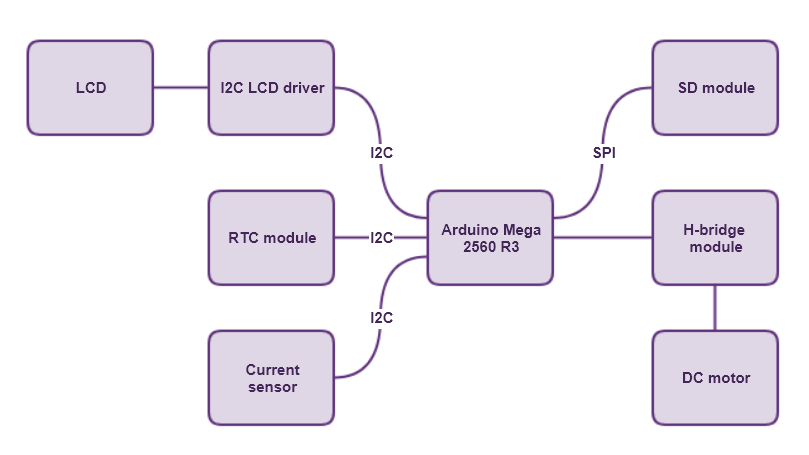
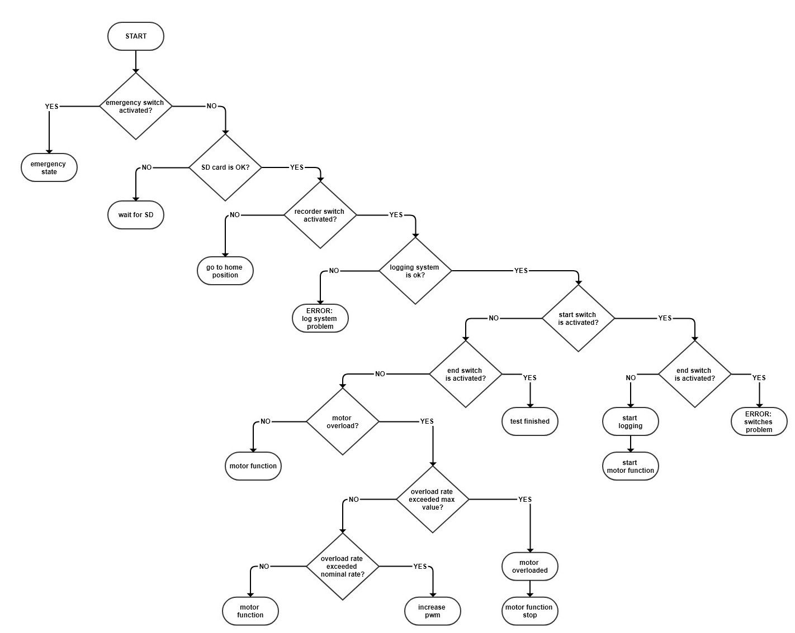

# TBRD

# Parts
| ## **PARTS**                                                                                                                | ## DESCRIPTION          |
| --------------------------------------------------------------------------------------------------------------------------- | ----------------------- |
| [RTC module DS3231](https://datasheets.maximintegrated.com/en/ds/DS3231.pdf)                                                | real time clock         |
| 16*2 LCD                                                                                                                    | -                       |
| [I2C LCD module](https://opencircuit.shop/resources/file/da88acc1702a90667728fcf4ac9c75c455475706466/I2C-LCD-interface.pdf) | lcd driver              |
| SD module YWRobot                                                                                                           | -                       |
| Arduino Mega 2560                                                                                                           | R3 revision             |
| [Current sensor INA219](https://cdn-learn.adafruit.com/downloads/pdf/adafruit-ina219-current-sensor-breakout.pdf)           | adafruit revision       |
| [H-Bridge module BTS 7960](https://www.handsontec.com/dataspecs/module/BTS7960%20Motor%20Driver.pdf)                        | high power motor driver |
| DC motor                                                                                                                    | -                       |

[schematic GLIFFY file](./TBRD_parts.gliffy)

# Control algorithm

[flowchart GLIFFY file](./TBRD_control.gliffy)

# Pin numbers
| ## Module        | ## **Arduino**                                                                                                                            |
| ---------------- | ----------------------------------------------------------------------------------------------------------------------------------------- |
| SD module        | [SPI interface](https://www.arduino.cc/en/reference/SPI), CS pin = 53                                                                     |
| RTC module       | [I2C interface](https://www.arduino.cc/en/reference/wire)                                                                                 |
| LCD + LCD driver | [I2C interface](https://www.arduino.cc/en/reference/wire)                                                                                 |
| Current sensor   | [I2C interface](https://www.arduino.cc/en/reference/wire)                                                                                 |
| motor driver     | R_en = 9, L_en = 8, Rpwm = 11,  Lpwm = 10;                                                                                                |
| switches         | start_sw_pin= 2 (start position) end_sw_pin = 3 (end position) emr_sw_pin= 19 (emergency switch) rec_sw_pin = 18 (record switch) |

# Necessary libraries
| ## Module        | ## Library                                                                                                                                                 | ## Description              |
| ---------------- | ---------------------------------------------------------------------------------------------------------------------------------------------------------- | --------------------------- |
| SD module        | - [SPI](https://github.com/arduino/ArduinoCore-avr/tree/master/libraries/SPI) - [SD](https://github.com/arduino-libraries/SD)                           | save log data               |
| RTC module       | - [DS3232](https://github.com/JChristensen/DS3232RTC) - [wire](https://github.com/arduino/ArduinoCore-avr/tree/master/libraries/Wire)                   | keep track of time          |
| LCD + LCD driver | - [wire](https://github.com/arduino/ArduinoCore-avr/tree/master/libraries/Wire) - [LiquidCrystal_I2C](https://github.com/johnrickman/LiquidCrystal_I2C) | UI                          |
| Current sensor   | - [wire](https://github.com/arduino/ArduinoCore-avr/tree/master/libraries/Wire) - [Adafruit_INA219](https://github.com/adafruit/Adafruit_INA219)        | feedback                    |
| -                | - [**arduino-timer**](https://github.com/contrem/arduino-timer)                                                                                            | non-blocking LCD refreshing |

# Code

[Arduino scripts](./TBRD/TBRD.ino)

