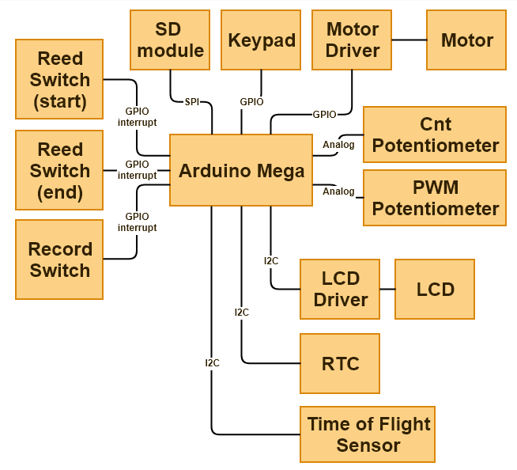
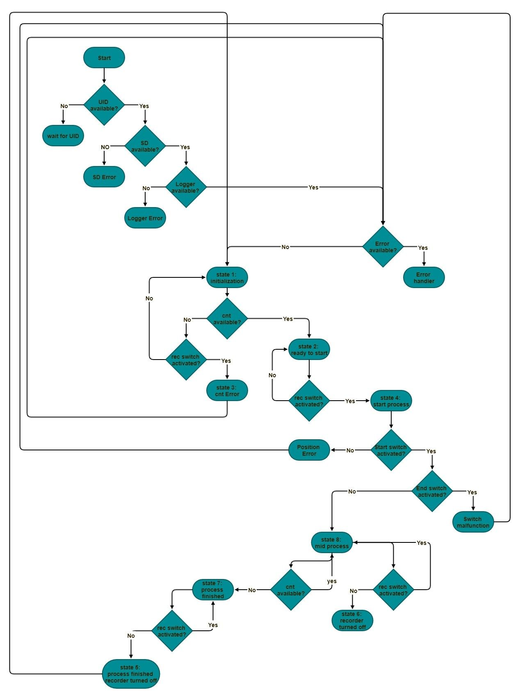

# TBRD 2

# state machine
| state number | pre_rec | rec | cnt | description                              |
| ------------ | ------- | --- | --- | ---------------------------------------- |
| I            | 0       | 0   | 0   | initial state                            |
| II           | 0       | 0   | 1   | ready to start                           |
| III          | 0       | 1   | 0   | error: cnt                               |
| IV           | 0       | 1   | 1   | start process                            |
| V            | 1       | 0   | 0   | process finished, recorder is turned off |
| VI           | 1       | 0   | 1   | recorder is turned off in mid process    |
| VII          | 1       | 1   | 0   | process finished                         |
| VIII         | 1       | 1   | 1   | mid process                              |

----------
## state flow

 -------------------------------
↓                                          ↑
 I → II → IV → VIII → VII → V
↓                       ↓
III                       VI

---

## diagrams

[diagrams GLIFFY file](./TBRD2.gliffy)

---

## code

[TBRD2 scripts without INA219 sensor](./TBRD2_final_noINA219/TBRD2_final_noINA219.ino)

[TBRD2 scripts final revision](./TBRD2_final_revised/TBRD2_final_revised.ino)